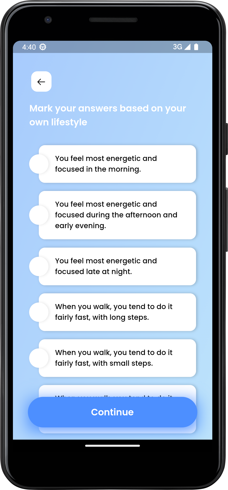
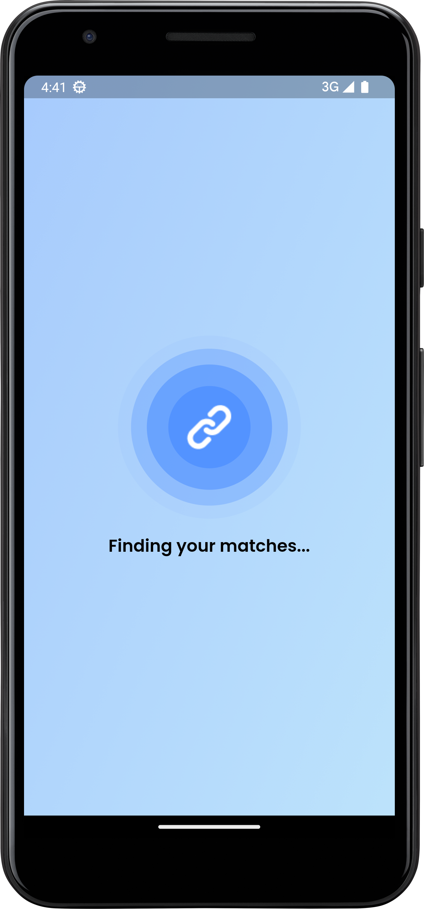

# MyCampus

MyCampus is a social networking app developed with Flutter, Flask, and Firebase. It connects users based on their personality, interests, and lifestyle. It features a user-friendly login and sign-up process, a comprehensive questionnaire to build profiles, a powerful match engine to find compatible partners, and a secure chat system with text and image support, as well as consent-based identity reveal. With MyCampus, you can easily find the perfect match and start building meaningful relationships.

## Features
* User-friendly login and sign-up process
* Comprehensive questionnaire for building profiles based on personality, interests, and lifestyle
* Powerful search engine for finding compatible partners
* Secure chat system with text and image support
* Consent-based identity reveal

## Technologies Used
* Flutter
* Flask
* Firebase

## Screenshots

<table>
  <tr>
    <td>Welcome Page</td>
     <td>Login Page</td>
     <td>Sign Up Page</td>
     
  </tr>
  <tr>
    <td valign="top"></td>
    <td valign="top"></td>
    <td valign="top"></td>
  </tr>
  <tr>
    <td>Personality Page</td>
    <td>Lifestyle Page</td>
    <td>Home Page</td>
  </tr>
  <tr>
    <td valign="top"></td>
    <td valign="top"></td>
    <td valign="top"></td>
  </tr>
  <tr>
    <td>Finding Matches Page</td>
     <td>Chat Page</td>
  </tr>
  <tr>
    <td valign="top"></td>
    <td valign="top"></td>
  </tr>
 </table>